# 第六回課題提出

* CloudWatch アラームを使って、ALB のアラームを設定して、メール通知

* アラームとアクションを設定した状態で、Rails アプリが使える
使えない状態にして、動作を確認

*  CloudTrail のイベント3つpick up

* AWS 利用料の見積を作成
  - 今日までに作成したリソースの内容を見積るできたものは URL を共有
   

* マネジメントコンソールから現在の利用料を確認
  * 先月の請求情報からEC2の料金がいくらか確認,無料利用枠で収まっているか
  

* * *

## アラームとアクションを設定した状態でRailsアプリが使える使えない状態にして動作を確認
* AmazonSNSでトピック作成

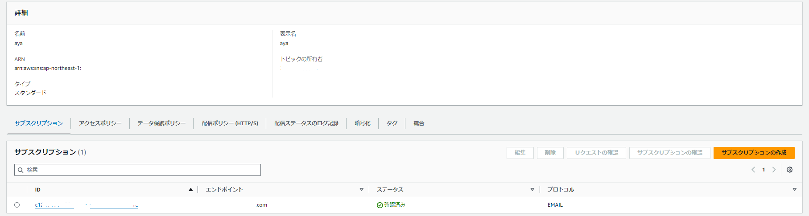

actionの追加
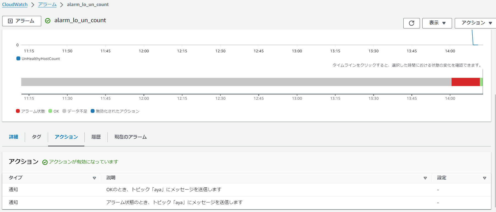

* アラーム設定とOKaction設定（停止）

* アプリケーション停止状態（Unhealthy）

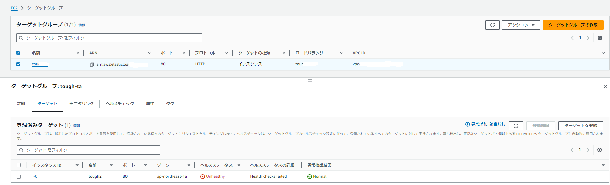

* アラームmail

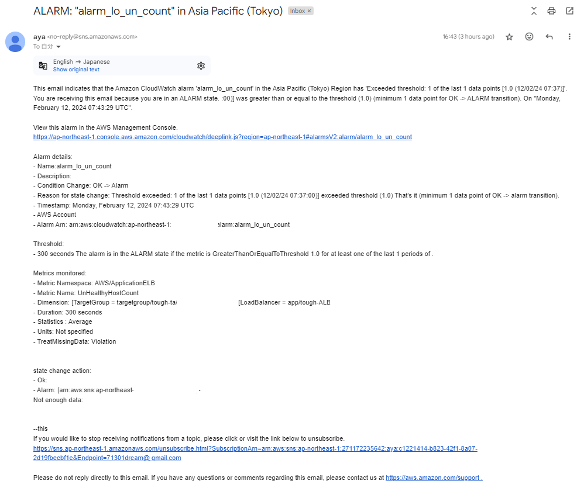

* * * *

* アラーム設定とOKaction設定（OK)

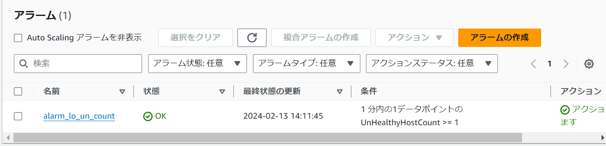

* アプリケーション起動状態(healthy)

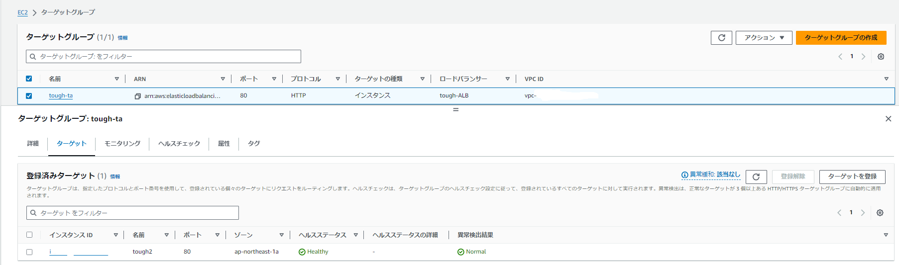

* OKaction mail

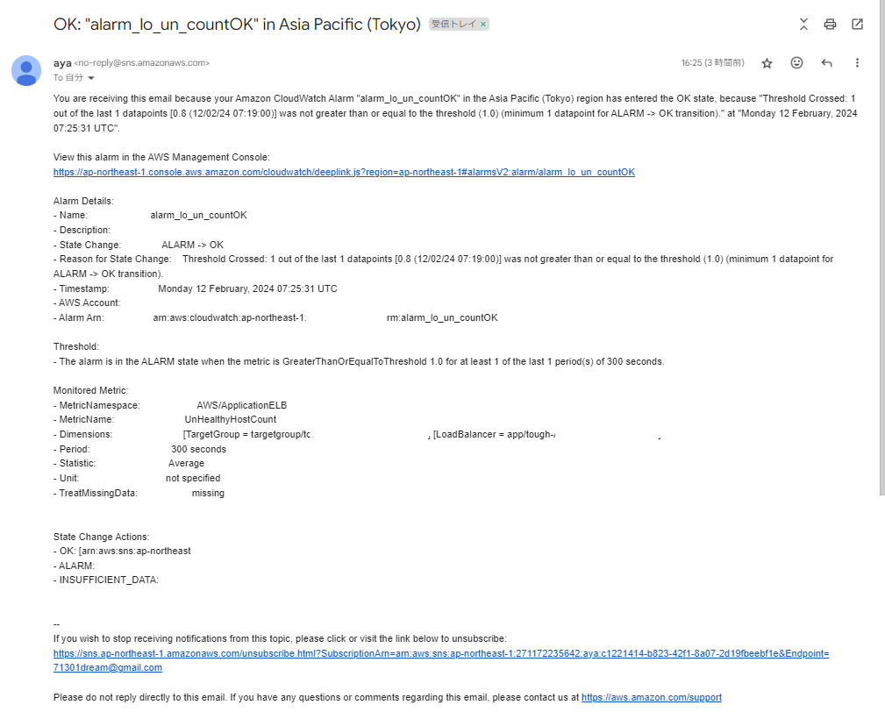

* * * *

## CloudTrail のイベント3つpick up
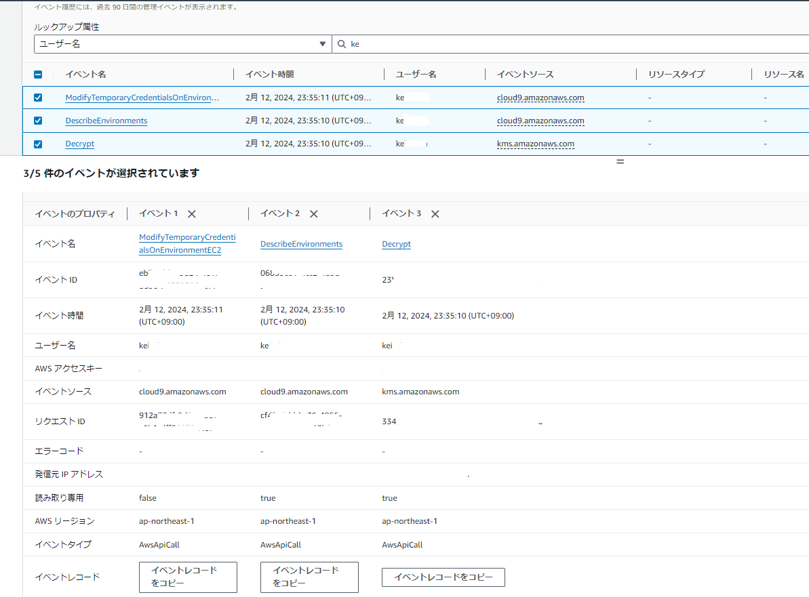

* * * *

## AWS 利用料の見積を作成

* [AWS利用の見積もりURL](https://calculator.aws/#/estimate?id=cf24c750eaf66109498a42a4c68d80c8ae948b2c)

 ※　１日２時間の稼働で見積（EC2,rds)

* * *

## マネジメントコンソールから現在の利用料を確認

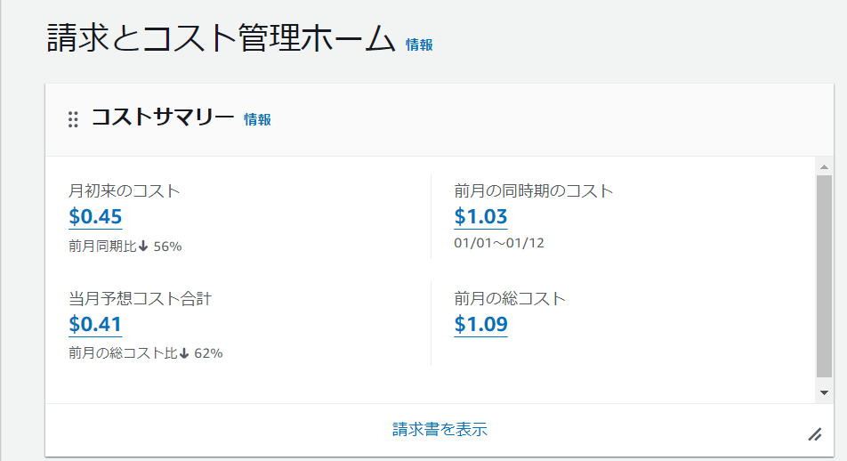

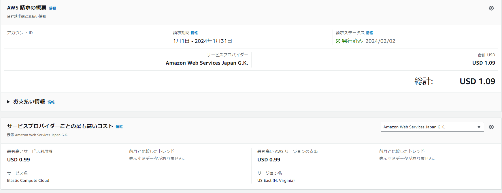

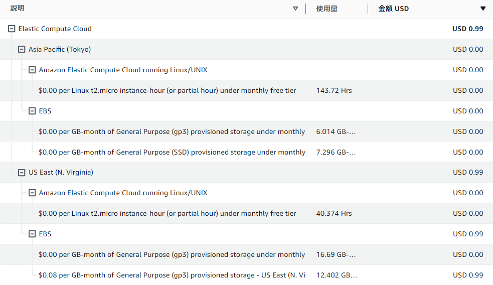

先月は無料枠を超えてしまった、主な要因としては違うリュージョンで使用していたして
いたインスタンスのボリュームを変更してしまっていてそのままだったことと、EC2,RDSを
作っては終了していたため超えてしまったと考えられる。

証跡を残す、証跡を取る

ログをとることの重要性、そしてログのないことの重大さを痛感した。

